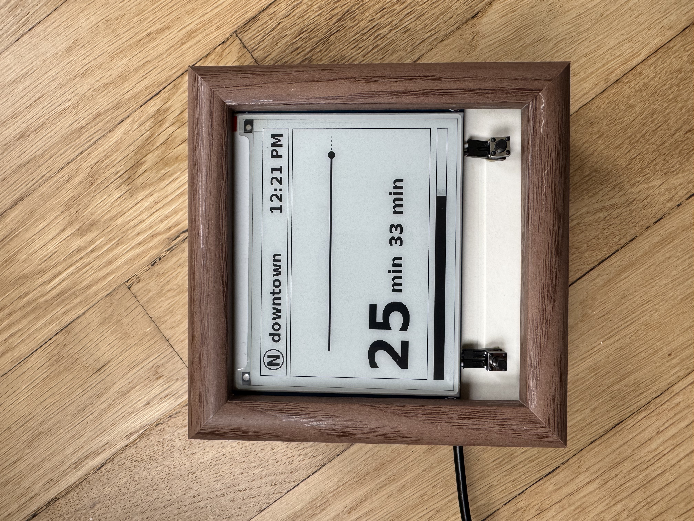
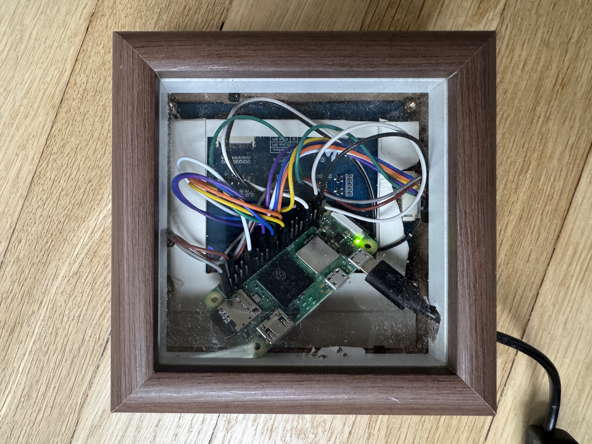
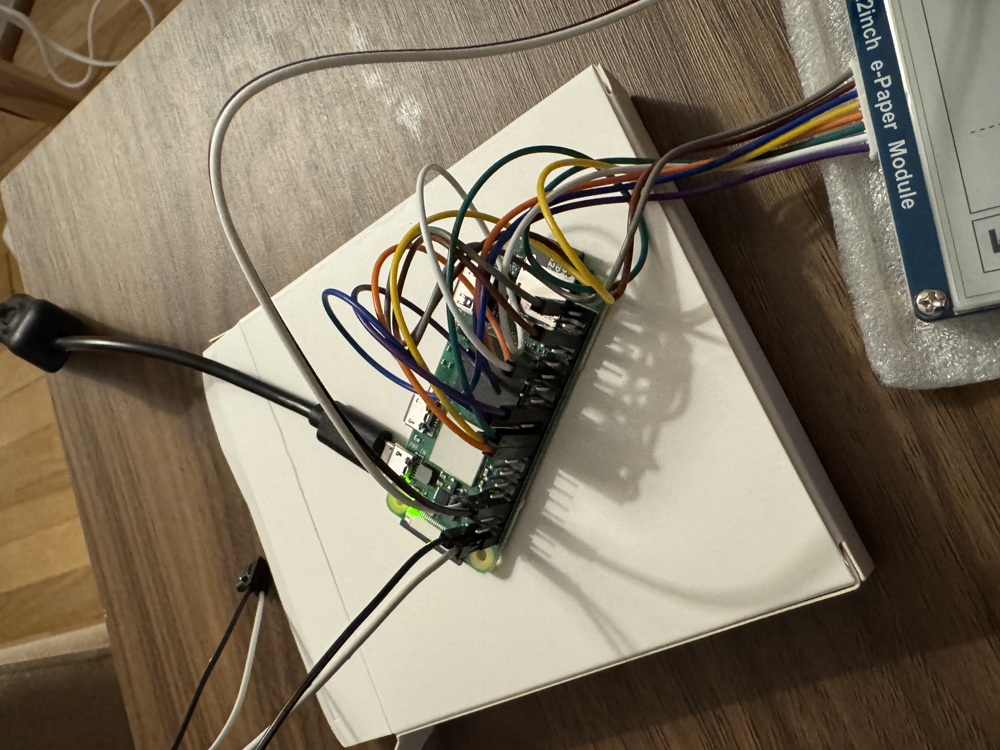
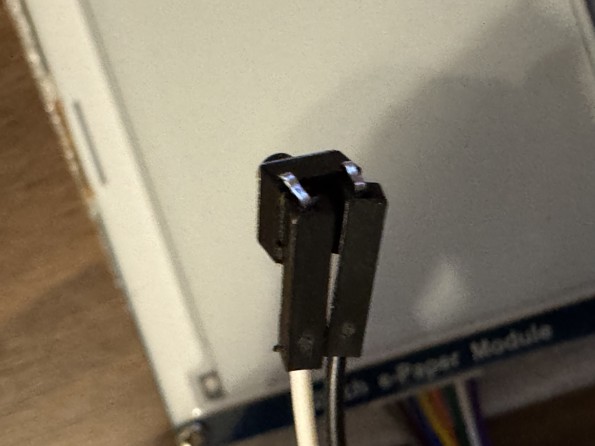
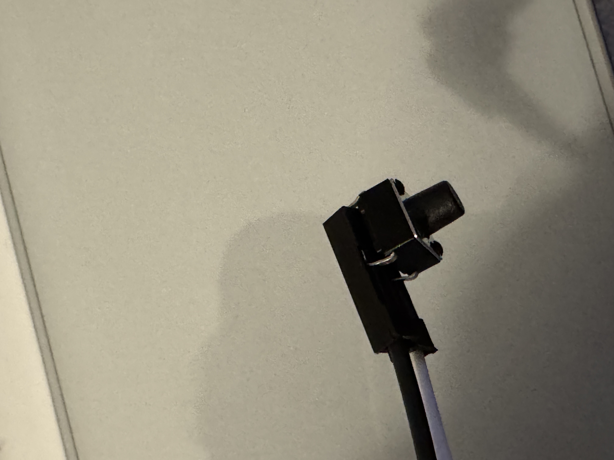

# transit-tracker


This repo contains the code to run a small, fun transit tracking dashboard. This README overviews exactly what to buy and how to run this code to get your own tracking setup.

<p float="left">
  
   
</p>

## Materials

There are a lot of examples of people making similar dashboards, but nothing that was 1) exactly what I wanted and 2) provided the exact materials to buy. After a lot of trial and error, here's what you need:

- [Raspberry Pi Zero 2 W](https://www.microcenter.com/product/683270/Raspberry_Pi_Zero_W_2_with_Headers) - This minimal, cheap version of the raspberry pi provides all the computational power that's needed for this project. It's important to get the pi with headers - otherwise you'll need to solder that yourself

- [Waveshare 4.2" E-Paper Display **Module**](https://www.waveshare.com/4.2inch-e-paper-module.htm) - This e-ink display should work out of the box for what we need. There's lots of other displays out there, but this one is the exact size I've used for this project - if you use a different display size, you will need to adjust the dashboard spacing to suit your needs. If you use a completely different board, the code in this repo will almost certainly not work for you. Getting the module is important, and this comes with the SPI interface that will allow us to easily connect to the Pi. This should also come with the 8-pin connection cable we'll use to connect to the pi

- [Micro USB Power Supply](https://www.amazon.com/dp/B0B79FVPQ4) - I chose this power cord because it comes with a little switch to turn the power on/off - there's a few steps where we need to disconnect power, so this makes it a bit simpler. But any power cord compatible with the pi should work.

- [Micro SD Card](https://www.amazon.com/dp/B01LXR6EOA) - This micro SD card comes preloaded with the raspberry pi image. This isn't really necessary - you can buy a cheaper one, because we'll be reimaging it anyways to be safe

### Optional

The following materials are optional for this project - only needed if you would like to add a sleep button or a manual refresh button:

- [Tactile Buttons](https://www.amazon.com/dp/B071KX71SV) - Simple tactile buttons. You can order other ones as well, anything would really work.
- [Dupont Wires](https://www.amazon.com/dp/B077X99KX1) - Wires to connect the buttons to the Pi. If you want an easier method, you could use a breadboard

## Prepping the Pi

Before we get to assmebling the hardware, we need to prepare the pi.

1. Insert the microSD into your laptop
2. Go to https://www.raspberrypi.com/software and install the imager
3. Open Raspberry Pi Imager
4. Click Choose OS, and select `Raspberry Pi OS (32-bit)`
5. Click Choose Storage and select your SD card. Click Next
6. Set hostname (optional)
7. Enable SSH
8. Configure Wi-Fi - Enter your Wi-Fi name & password
9. Configure your country, username, and password (you'll need this to ssh)
10. Once imaging is done, insert the MicroSd into the Pi. You will need to pull the microSD out of the laptop adapter
11. Power the pi with the power adapter
12. Wait some time for it to boot
13. Get your devices IP address. I used the Xfinity app to get this, but there's other ways to do this as well.
14. SSH into the pi: `ssh rbhushan@10.0.0.236` and enter your password. If this doesn't work the first time, try waiting a few minutes. If it still doesn't work, try unplugging the pi and turning it back on.

Note - the pi will be ready to SSH if you see a single, steady green light. If you see inconsistent flickering/blinking, this means that the pi is doing something. If you see a steady pattern of blinks, this may be an error code. In this case, you may need to reimage.

## Enable SPI

Run `sudo raspi-config`, and then use arrow keys and Enter:

1. Interface Options
2. SPI
3. Select Yes
4. Select OK
5. Finish

Then run `sudo reboot`

## Assembling the Hardware



At this point, you are able to SSH into the pi at any time. Now, turn off the pi by unplugging the power. We are going to connect the display to the pi. This part is extremely important to get right, and where I spent the most time.

First, align your pi in "portrait", where the pins are to the right, and the power-in is to the left, and the SD card slot is to the top. In this orientation, you will see 2 columns of 20 pins each. Pin numbering is left to right, top to bottom:

1 2 \
3 4 \
5 6 \
... \
39 40 \

Plugin the 8-pin cable into your display first. Make sure to push it in ALL the way - you'll face some resistance but it can, and must, go all the way in. Note that each colored cable now maps to a different code (e.g. VCC, BUSY, etc).

Follow the instructions here - https://www.waveshare.com/wiki/4.2inch_e-Paper_Module_Manual#Working_With_Raspberry_Pi to understand the GPIO pin mappings. Note that 3.3V is Pin 1, and GND is pin 6 on the pi. Use the Board column, not the BCM column.

Note that the most important here are the VCC/GND pin - messing this up could mess up your display or board. The other pins are also important, but won't ruin anything (just introduce bugs ;)

## Setup Waveshare API

Now, we're mostly done with the hardware portion, and we'll test our connection to the display. We're going to follow the python guide, but Waveshare also provides a C library (if you want to recreate all the code for fun)

Reference: https://www.waveshare.com/wiki/4.2inch_e-Paper_Module_Manual#Python

Run the following commands (we are using Python3):

```
sudo apt-get update
sudo apt-get install python3-pip
sudo apt-get install python3-pil
sudo apt-get install python3-numpy
sudo pip3 install spidev
```

```
sudo apt-get update
# python3
sudo apt install python3-gpiozero
```

```
git clone https://github.com/waveshare/e-Paper.git
cd e-Paper/RaspberryPi_JetsonNano/
```

```
# Make sure it's in e-Paper/RaspberryPi_JetsonNano/
cd python/examples/
python3 epd_4in2_V2_test.py
```

At this point, you should see some stuff appear on the display. If you see NOTHING change - this is likely a wiring issue. It's possible you have something else messed up, but these steps did work for me - the only difficulty I ran into was messing up the wiring by looking at some different documentation.

## Running the code

At this point, we've installed all our dependencies and are ready to display OUR dashboard!

First, we'll clone this repo:

```
cd ~
git clone https://github.com/rbhushans/transit-tracker.git
```

Next, we're going to manually make the waveshare library available. There's probably better ways to do this, but this was the easiest way for me:

```
cd ~/transit-tracker/src
cp -r ~/e-Paper/RaspberryPi_JetsonNano/python/lib/waveshare_epd .
```

Now, we're ready to run the code:

```
cd ~/transit-tracker
python3 -m src.transit_tracker
```

### API Fetching

For my usage, I use bay area transit data from 511.org (https://511.org/open-data/transit). This data is free and available to use by anyone. You can easily sign up for an API key here. If you are located in a different area, there is likely a similar API for you - but you will most likely need to change some of the data fetching code to work with this different API

For Bay area transit data, we can use the following to enumerate all agency codes:

https://api.511.org/transit/gtfsoperators?api_key=YOUR_API_KEY

Once you've figured our your agency code, we need the stopId. Personally, I used the SFMTA website to find my stop ID - https://www.sfmta.com/stops/judah-st-9th-ave-15194, and it's available at the top (e.g. in this case, 15194)

Finally, we can request the next trains using:

https://api.511.org/transit/StopMonitoring?api_key=YOUR_API_KEY&agency=SF&stopcode=15194

## Configuring the Code

At this point, you can now configure the transit tracker for your own usage! Note that for probably most cases, you will need to make some changes to the data fetching - it's setup in a somewhat abstracted way, but every stop and every line (and what every person cares about) will all be different.

- DEBUG - This flag determines whether we use fake data, or actually make API calls. Note that 511.org transit data has strict rate limiting - so be careful!
- API_KEY - Your API key from 511.org - make sure not to commit this or make this publicly available.
- AGENCY - The transit agency (specific to 511.org)
- STOP_CODE - The ID of the stop (specific to 511.org)
- API_URL - The fetch URL with all of the above (specific to 511.org)
- REFRESH_INTERVAL - How often we refresh the data (seconds). Transit data has strict rate limits, which is 60 requests in 3600s. I added a 15s buffer on top of this just to be safe, but technically could do 60 here.
- MAX_TRAIN_MINUTES - The scale of the train animation. A larger value will allow a train to show up sooner (e.g. if you set it to 20, a train 18 minutes away will be visible). I set it to 10 because when you get to larger values, the scaling becomes a bit odd where you really want the visual granualrity at smaller numbers - the difference between 17 and 18 minutes is not much
- HEADER_LABEL - Single character denoting the line. With some font size and position adjusting, you can probably make this work for 2 or more digits
- HEADER_DESTINATION_LABEL - The destination - in my case "downtown"
- DESTINATION_NAME - In some cases, a single stop may serve multiple destinations - add this filter if you want to filter to a certain destination. Set to None otherwise.

## Buttons!

If you would like to add a power and/or manual refresh button, use the following instructions. Make sure the Pi is turned off while you do the wiring.

1. See above for materials for buttons
2. You will need two buttons, and 4 wires (innies\* on either side)
3. First, connect the button to one end of each of the wires. The easiest way to do this is by inserting one of the hooks into the little slot at the head, and the other hook into the hole (see image below).
4. Once you've connected the 4 wires to the two buttons, take each button + wire combo, and attach them to the following:
   a. Sleep Button: Pins 39 and 40 (GND)
   b. Manual Refresh Button: Pins 33 and 34 (GND)
5. Now, switch your branch to "buttons", and run the main script.
6. Try clicking the sleep button to see the display go to sleep, and click it again to wake it up.
7. Try clicking the refresh button to see the progress tracker reset, and the data refresh on command





\* Note - I use innies/outties above as a fun alternative to the (in my opinion) dated female/male terminology that may be a bit more ubiquitous in wiring.

## Autostart

Once you've wrapped all development, it's time to enable the script to automatically start when turned on. This will make it so that you don't need to manually ssh into the Pi to start the script.

Run the following to create and copy the service file

```
sudo cp ~/transit-tracker/transit-tracker.service /etc/systemd/system/
```

Then run the following sequentially to set the service up:

```
sudo systemctl daemon-reexec
sudo systemctl daemon-reload
sudo systemctl enable transit-tracker.service
```

Before rebooting, we can test the service:

```
# start the service - you should see the display working now
sudo systemctl start transit-tracker.service

# check status
systemctl status transit-tracker.service

# check logs
journalctl -u transit-tracker.service -f
```

Finally, try rebooting:

```
sudo reboot
```
